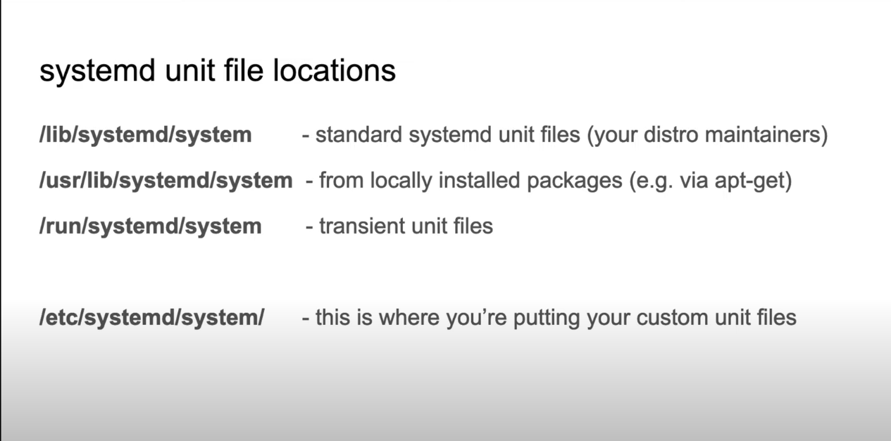
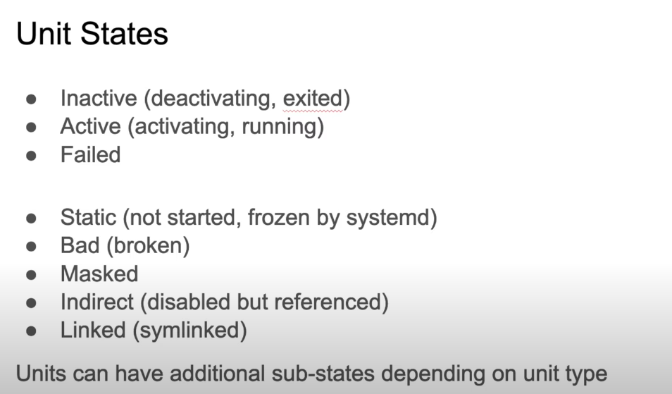

 # Systemd | Linux Essentials

- ```systemd``` is the default ``init`` system and service manager for most major Linux distributions, acting as the first process (PID 1) to start at boot and manage the entire system's processes and services. 

- It uses Linux control groups (cgroups) for process tracking, enables on-demand daemon startup, supports system snapshotting, maintains mount points, and provides a unified framework for system management.  

 ### File locations


- All the custom systemd file are stored in:  
```sahil@Sahil-Linux:/media/sahil/local2/coding_Projects/Linux-esstentials$ ls /etc/systemd/system``` -> and we can create the new file or ```service``` in this path.

```bash
#create a new service file
sahil@Sahil-Linux:~$ sudo vim /etc/systemd/system/sahilservice.service

#content of the file
sahil@Sahil-Linux:~$ cat /etc/systemd/system/sahilservice.service
[Unit]
Description=A very simple service created by Sahil.
After=network-up.target

[Service]
ExecStart=/usr/local/bin/sahilprogram

[Install]
WantedBy=multi-user.target

#reload the systemctl daemon
systemctl daemon-reload
```
------------------------------

## Systemctl - cmd
```bash
#cmds
systemctl

# list all the service units 
systemctl list-units --type=service

# all the unit files which are disabled and enabled
systemctl list-unit-files

# status of the service 
systemctl status $unit

# to stop the service
systemctl stop $unit

# to restart the service
systemctl restart $unit
# eg: systemctl restart ngnix

# to kill the service
systemctl kill $unit
```

### Unit status


-------------------------------
## Systemd Targets
- kind of like custom, named runlevels

```bash
systemctl isolate $target
# eg: systemctl isolate sysinit.target

# get the default target
systemctl get-default
```